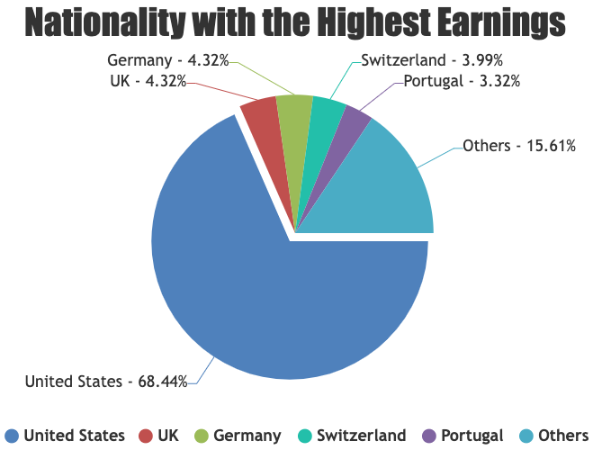
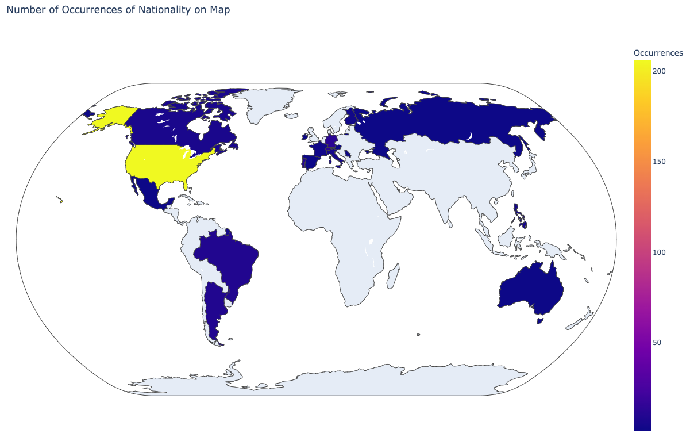
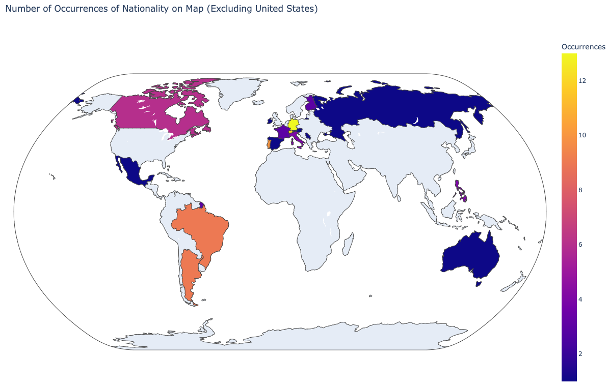
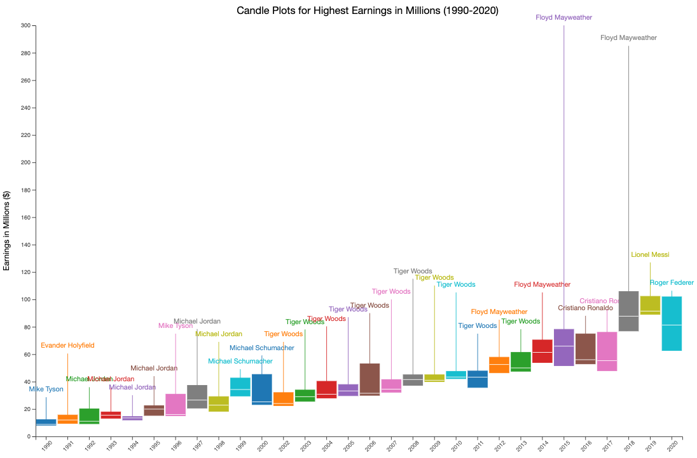
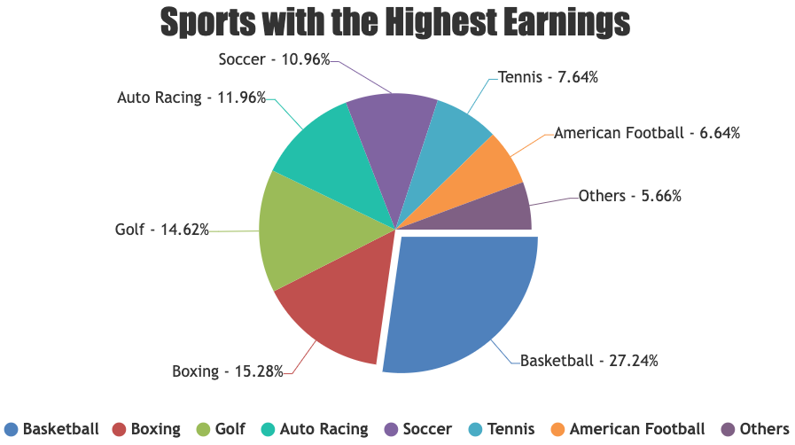
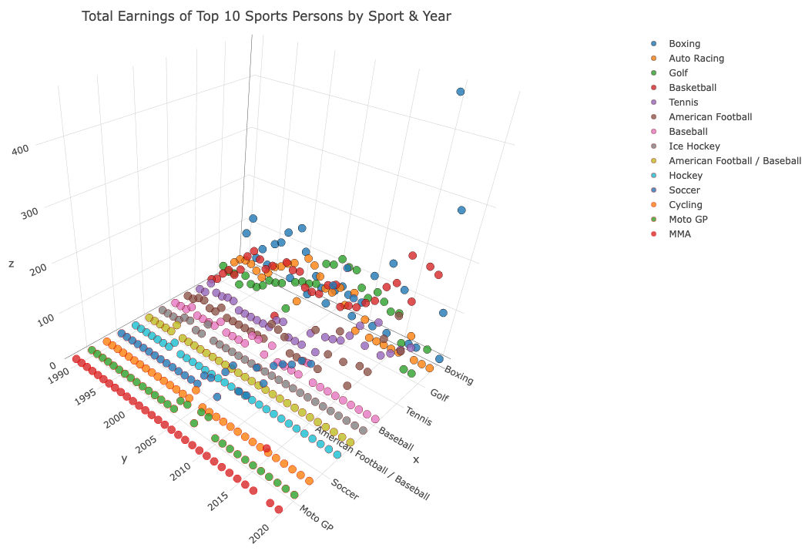
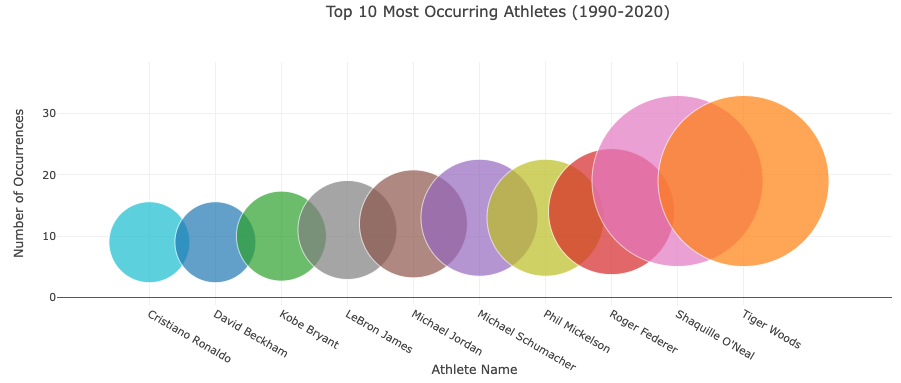

# 17-18-Project-3
Data Analytics Boot Camp Project 3: 
* Applying what I've learned in data analytics to a real-world data set

# Summary
This presentation explores the evolution of athlete's earnings over three decades, highlighting the top 10 earners and trends in the sports industry. Firstly, I went through a data cleaning process before the code ran, it worked and was not going to cause further errors. I have logically worked through the data set showing the graphs and data points I felt told this story with the most detail. 

# Nationality of Athletes
* United States has a dominance for the three-decade span of this data set 209 of the 300 athletes (68.44%). 
* European Presence is high in the top 5 other countries, UK (13), Germany (13), Switzerland (12) and Portugal (10).
* 1 Athlete from Australia – Greg Norman Golf in 1990.

 

# Change In Athletes Revenue
* On the right, we present a candle plot illustrating the upward trend in athlete salaries from 1990 to 2020.
* In both 2015 and 2018, two outliers significantly impacted the data.
* These outliers were attributed to Floyd Mayweather, who earned an extraordinary $285 million and $300 million in those respective years.

# Top Sports to Earn Most Money
* Which sports get the biggest piece of pie? 
Pie chart showing the Top 10 sports people earnings by percentage split by sport since 1990
* How do sports compare over the years? 
Interactive 3D plot  showing total earnings per sport, per year since 1990. Sport can be toggled on and off at legend to compare to each other and for clarity.

# Top 10 Most Occurring Athletes
* Showcases the 10 most frequently occurring athletes within the dataset, with the size of their bubble being a direct correspondent to this. 
* At the forefront, we see Tiger Woods represented with the largest bubble, Tiger’s dominance of the golfing world for nearly 20 years earned him a cool 1.37 billion dollars.

# Key Take Aways
* Tiger Woods dominates the list of Top ranked recently while earlier it was Michael Jordan.
* USA dominates the world when it comes to earnings.
* Monica Seles is the only women to make the top-10 highest paid athlete, since 1990.
* Top 3 earners in 2020 are soccer players.
* Top 3 lifetime earners in our data set all play different sports.
* Basketball players earn the most followed by Boxing and Golf.

# Reasons for Changes in Salaries
* Globalisation of sports and the impact of social media/broadcasting have expanded the athlete's market, engaged a broader fan base and attracting sponsors.
* Increasing corporate investment in sports sponsorships and partnerships has created additional revenue streams for athletes.
* Athlete popularity surge has resulted in more endorsement opportunities with major brands, leading to increased earnings.

# Conclusion
* In conclusion, the Forbes Highest Paid Athletes 1990-2020 presentation showcases the remarkable growth of athlete earnings and highlights the integral role of endorsements and global events in shaping the sports industry's financial landscape.
* It is evident that the world of sports has witnessed a paradigm shift in athlete earnings, demonstrating the immense potential for financial success through talent, brand endorsements, and strategic career choices.

# Data Source
- https://www.kaggle.com/datasets/parulpandey/forbes-highest-paid-athletes-19902019?resource=download